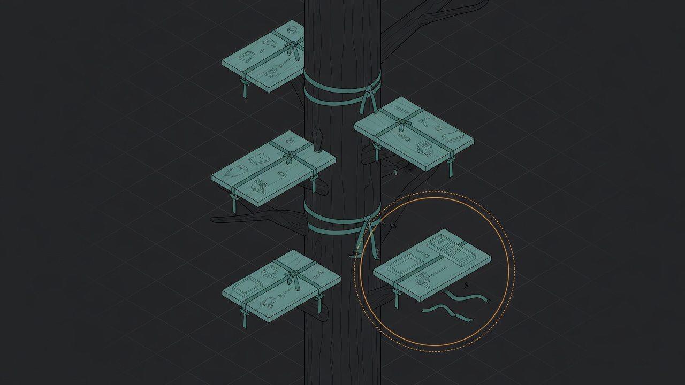
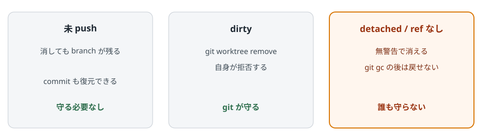
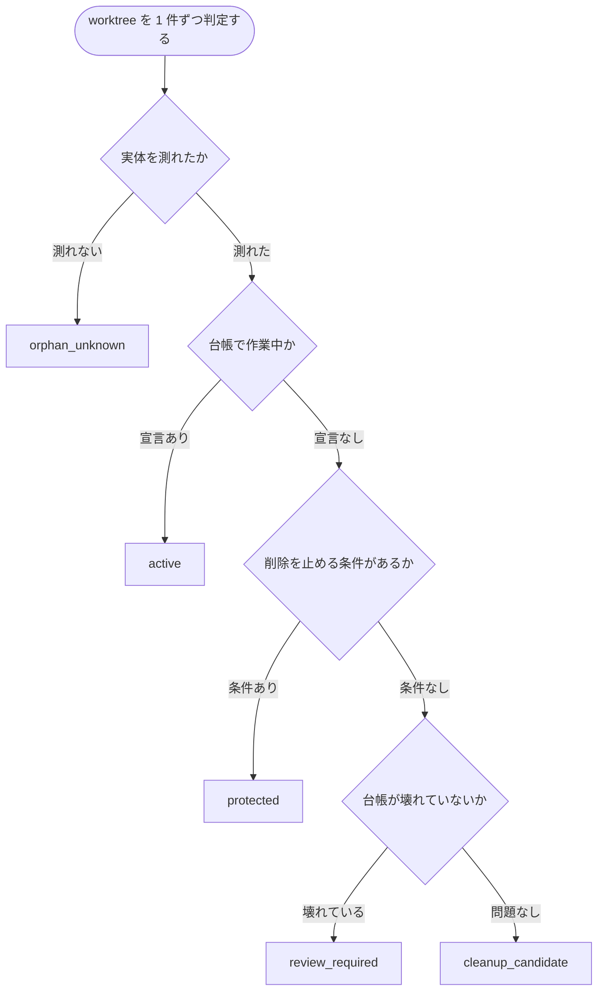

# Worktree Lifecycle Control

Git worktree を増えたフォルダとして放置せず、到達不能な detached HEAD だけを守るローカル CLI です。削除はしません。

[](https://github.com/nexus-ai-2045/worktree-lifecycle-control/actions/workflows/ci.yml)
[](https://github.com/nexus-ai-2045/worktree-lifecycle-control/releases)
[](LICENSE)
[](pyproject.toml)

[](docs/decisions/0002-protect-what-git-does-not.md)

結びが残っている worktree は、消しても branch から戻せる。切れた 1 台だけが、git の外に落ちる。絵は [ADR 0002](docs/decisions/0002-protect-what-git-does-not.md) へ行く。

## 目的 — git が守らない 1 行だけを守る

[](tests/test_reachability.py)

3 列は隔離 repo での対照実験。クリック先は毎回同じことを再現する [test_reachability.py](tests/test_reachability.py)。

> detached HEAD の worktree を消すと、その commit は無警告で消え、`git gc` の後は戻せません。

修復は名前を付けるだけです。

```bash
git branch rescue/<name> <head-sha>
```

この CLI はその件数を `danger_count` として scan の先頭に出します。根拠は [ADR 0002](docs/decisions/0002-protect-what-git-does-not.md)。

- git が守るものを二重に守らない。
- 経過日数は通知であり、削除条件にしない。
- `cleanup_candidate` は削除許可ではなく、人間レビュー用候補。

## できること

| コマンド | 何をするか |
| --- | --- |
| `scan` | worktree ごとの disposition / blockers / review_signals を JSON で出す |
| `review-packet` | 削除を実行せず、人間レビュー用 packet を出す |
| `evidence-from-closeout` | 既存の closeout collector 出力を統合証跡へ正規化する |

## クイックスタート

人間が pip や scan を叩く手順は置いていません。次をそのまま AI に貼ってね。

```text
このリポジトリを読んで直してね。まず危険レビューから出してほしい。
削除・--force・GitHub write・visibility 変更・secret 露出・個人パスをしていないか確かめて。
cleanup_candidate は削除許可と読まないで。unknown も安全と読まないで。
問題があればコードを書く前に止まってね。CONTRIBUTING を守ってね。

https://github.com/nexus-ai-2045/worktree-lifecycle-control
https://raw.githubusercontent.com/nexus-ai-2045/worktree-lifecycle-control/main/README.md
https://raw.githubusercontent.com/nexus-ai-2045/worktree-lifecycle-control/main/CONTRIBUTING.md
https://raw.githubusercontent.com/nexus-ai-2045/worktree-lifecycle-control/main/SECURITY.md
https://raw.githubusercontent.com/nexus-ai-2045/worktree-lifecycle-control/main/PREFLIGHT.md
```

コマンド名は上の「できること」を見てもらえば十分です。この CLI は消しません。
## 判定

危険条件は一つの状態へ潰さず、`blockers[]` へ同時に保持します。削除を止めない情報は `review_signals[]` へ分けます。



| disposition | 意味 |
| --- | --- |
| `active` | 台帳で作業中 |
| `protected` | 到達不能・dirty・lock・primary・pin |
| `review_required` | 台帳の宣言が壊れている |
| `cleanup_candidate` | blocker なし。人間レビュー候補 |
| `orphan_unknown` | path 不在など実体不明 |

blocker に載るのは `head_becomes_unreachable`、`dirty_worktree` / `worktree_locked`、`primary_worktree`、`pinned`、測定不能、`unknown_ignored_content` だけです。未 push や owner 不明は `review_signals[]` に出ます。

## 統合証跡 (任意)

統合状態は削除条件ではなく表示用の signal です。branch が base に取り込まれているかは `git cherry` で毎回導出します。

GitHub 上で PR が merge されたかどうかだけは git から導出できないため、adapter が `status` / `provider` / `evidence_type` / `provider_record_id` / 40 桁 SHA 2 つ / `actor` / timezone 付き `observed_at` を全部返す必要があります。不足は fail-closed です。

```powershell
python path\to\post_merge_closeout_report.py collect --repo owner/name --pr 1 --cwd . --json |
  python -m worktree_lifecycle_control evidence-from-closeout --actor <merge した account> --json
```

`--actor` は省略できません。collector が `mergedBy` を返すようになれば不要です。

```powershell
gh pr view 1 --repo owner/name --json mergedBy --jq .mergedBy.login
```

## 台帳 (任意)

台帳は無くても動きます。書くのは git から導出できない人の意思だけです。`pin` / `reason` / `expires_at` / `return_path` / `lifecycle_status`。期限超過だけで `cleanup_candidate` にはなりません。

## 制約

- 削除、`--force`、GitHub write、定期実行は行いません。
- `cleanup_candidate` は削除許可ではありません。
- 実運用 registry と `.local/` の scan 結果は公開対象にしないでください。

## ライセンスと出典

コードは MIT License（`LICENSE`）。Copyright (c) 2026 nexus_ai。
第三者データのミラーは含みません。
