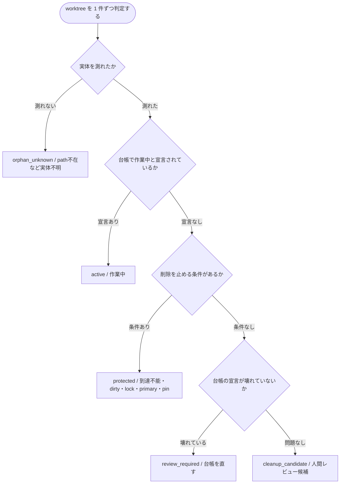

# Worktree Lifecycle Control

Git worktree を「増えたフォルダ」ではなく、所有者・タスク・期限・統合証跡を持つ期限付き作業資産として管理するためのローカル制御ツールです。

[](https://github.com/nexus-ai-2045/worktree-lifecycle-control/actions/workflows/ci.yml)
[](https://github.com/nexus-ai-2045/worktree-lifecycle-control/releases)
[](LICENSE)
[](pyproject.toml)

## 目的 — git が守らない 1 行だけを守る

> detached HEAD の worktree を消すと、その commit は無警告で消え、`git gc` の後は戻せません。
> git が唯一守らないのがこの 1 行です。

worktree を削除しても、多くの場合なにも失われません。branch が残るからです。
隔離 repo での対照実験 (CI が `tests/test_reachability.py` で毎回再現) の結果:

| 状態 | worktree を削除すると | 誰が守るか |
| --- | --- | --- |
| 未 push commit がある | branch が残り、commit も内容も復元できる | 失われないので保護不要 |
| 未保存の変更がある | `git worktree remove` 自身が拒否する | git |
| detached HEAD で、どの ref からも指されていない | **無警告で削除され、`git gc` 後に復元できない** | **誰も守らない** |

最後の 1 行がこのツールの存在理由です。`danger_count` として scan report の先頭に出します。

修復は branch か tag を付けるだけです。

```bash
git branch rescue/<name> <head-sha>
```

### 設計方針

- **git が守るものを二重に守らない。git が守らないものだけを守る。**
- 経過日数は通知条件であり、削除条件にしない。
- worktree、branch、task、PRを別の対象として扱う。フォルダを消しても branch は残る。
- `cleanup_candidate` は削除ではなく、人間レビュー用候補を意味する。
- 通常フローでは `--force` を使わない。
- Gitの機械可読形式 `git worktree list --porcelain -z` を使う。

判定モデルの根拠と、v2 から反転した理由は
[ADR 0002](docs/decisions/0002-protect-what-git-does-not.md) にあります。

## できること

この CLI は read-only の棚卸しと、人間レビュー用の cleanup 候補判定までを行います。

| コマンド | 何をするか |
| --- | --- |
| `scan` | worktree ごとの disposition / blockers / review_signals を JSON で出す |
| `review-packet` | 削除を実行せず、人間レビュー用 packet を出す |
| `evidence-from-closeout` | 既存の closeout collector 出力を統合証跡へ正規化する |

## クイックスタート

必要なのは Python 3.11+ と、対象 repo のパスだけです。台帳 (registry) は任意です。

```powershell
python -m worktree_lifecycle_control scan `
  --repo path\to\your-repo `
  --registry registry.example.json `
  --report-path .local\reports\worktrees.json `
  --json
```

このコマンドはread-onlyです。削除コマンドは実装していません。
`--report-path`を指定した場合だけ、棚卸し結果をUTF-8 JSONとして指定先へ保存します。

人間レビュー用packetも、削除を実行せず生成できます。

```powershell
python -m worktree_lifecycle_control review-packet `
  --repo path\to\your-repo `
  --registry registry.example.json `
  --report-path .local\reviews\review.json `
  --json
```

既存の closeout collector から統合証跡を正規化できます（GitHub 取得は collector 側）。

```powershell
python path\to\post_merge_closeout_report.py collect `
  --repo owner/name `
  --pr 1 `
  --cwd . `
  --json |
  python -m worktree_lifecycle_control evidence-from-closeout --actor <merge した account> --json
```

`--actor` は省略できません。2026-08-20 時点の collector は `mergedBy` を要求しない
ため、省略すると「誰が merge したか不明」のまま証跡を作らず exit 2 で失敗します
（欠落を既定値で埋めません）。collector が `mergedBy` を返すようになれば、そちらが
優先され `--actor` は不要になります。merge した account は次で確認できます。

```powershell
gh pr view 1 --repo owner/name --json mergedBy --jq .mergedBy.login
```

## 判定

危険条件は一つの状態へ潰さず、`blockers[]`へ同時に保持します。削除を止めない情報は
`review_signals[]`へ分けます。その上で、操作可否だけを`disposition`へ集約します。



| disposition | 意味 |
| --- | --- |
| `active` | 台帳で作業中と宣言されている |
| `protected` | 削除を止める条件あり (到達不能・dirty・lock・primary・pin) |
| `review_required` | 台帳に宣言があるのに壊れている |
| `cleanup_candidate` | blockerなし。人間レビュー候補 |
| `orphan_unknown` | path不在など実体不明 |

`blockers[]` に載るのは次だけです。

| blocker | 理由 |
| --- | --- |
| `head_becomes_unreachable` | 削除すると HEAD が unreachable になる。git は守らない |
| `dirty_worktree` / `worktree_locked` | git 自身が削除を拒否する |
| `primary_worktree` | そもそも削除できない |
| `pinned` | 人が台帳で明示保護した。git から導出できない唯一の条件 |
| `path_missing` / `git_status_unknown` / `head_reachability_unknown` | 測定できなかった |
| `unknown_ignored_content` | Git が無視する内容のうち、明示した再生成可能 allowlist 外のものがある |

統合状態・未 push commit・owner 不明・台帳の記入漏れは `review_signals[]` に出ます。
判断材料ですが、削除を止めません。

## 統合証跡 (任意)

統合状態は削除条件ではなく表示用の signal です。branch が base に取り込まれているかは
`git cherry` (patch equivalence) で毎回導出するため、台帳への記入は要りません。

GitHub 上で PR が merge されたかどうかだけは git から導出できないため、宣言できます。
その場合、adapter は次をすべて返す必要があります。

- `status: verified`
- `provider`
- 証拠の意味を示す`evidence_type`
- 一次証拠を識別する`provider_record_id`
- scan対象と一致する40桁の`subject_head_sha`
- 統合先を示す40桁の`resulting_base_sha`
- `actor`
- timezone付き`observed_at`（scan時点から7日以内）

不足・SHA不一致・7日超過・未来時刻の場合、`integration_evidence_invalid` を signal に出します。

証跡契約は `integration-evidence-v3` です。`observed_at` は adapter 実行時刻ではなく、
closeout payload の `observed_at` または `collected_at` を引き継ぎます。欠落時は古い保存済み
payload の鮮度を更新しないよう fail-closed で失敗します。merge 時刻は
`subject_merged_at` に別項目として持ちます。両者を混ぜると、7 日より前に merge された PR は
今この瞬間に観測し直しても永久に stale と判定されます。

`actor` は統合を実行した主体で、収集を実行した主体 (`observed_by`) とは別の事実です。
2026-08-20 時点の `post_merge_closeout_report.py collect` は `mergedBy` を要求していないため、
上流が返すまでは `--actor` で明示してください。特定できない場合は失敗します (欠落を既定値で埋めません)。

## 台帳 (任意)

台帳は**無くても動きます**。判定に必要な事実はすべて git から導出します。

台帳に書くのは「git から導出できない、人の意思」だけです。全項目が任意です。

| 項目 | 意味 |
| --- | --- |
| `pin` | `true` なら削除候補に出さない。唯一 git から導出できない保護条件 |
| `reason` | pin する理由。将来の自分と他セッションのために書く |
| `expires_at` | 見直し期限。通知条件であり削除条件ではない |
| `return_path` | 作業を再開する時に戻る場所 |
| `lifecycle_status` | `active` なら作業中として扱う |

v1 は「登録が無いと削除候補にしない」allowlist でした。台帳が空である限り候補が
構造的に 0 件になりました。v2 では「登録した物だけ守る」opt-out protection へ反転しています。

`owner` / `task` は任意の運用メタデータで、未記入時は `null` です。Git の author や branch
から所有者・タスクを推測しません。`integration` は外部 provider の証跡を任意で保持できます。

期限超過だけで `cleanup_candidate` にはなりません。

## 日数の表示

「年齢」という曖昧な表現は使わず、次を別々に表示します。

| JSON field | 日本語での意味 | 用途 |
| --- | --- | --- |
| `days_since_created` | 作成からの経過日数 | 長期化の通知 |
| `days_since_head_commit` | HEAD commitのcommitter dateからの経過日数 | commit時点の古さの確認 |
| `days_until_review` | 見直し期限までの残り日数 | review予定 |
| `overdue_days` | 見直し期限の超過日数 | review優先度 |

いずれもカレンダー日数として計算します。0日は「今日」、1日は「1日前／期限まで1日」です。期限を過ぎた場合は`days_until_review: 0`とし、超過分を`overdue_days`へ表示します。何日経過しても、日数だけではworktreeを削除しません。

通常表示では次の形にまとめます。

```text
作成から: 不明（台帳未登録） / HEAD commitから: 22日 / 見直し: 未設定
```

## 制約

- 削除、`--force`、GitHub write、定期実行、Projects 全体への配線は行いません。
- `cleanup_candidate` は削除許可ではなく、人間レビュー用の候補です。
- scan / review packet はヒューリスティックであり、専用 secret scanner や人間レビューを置き換えません。
- 実運用 registry の owner / task 台帳、`.local/` の scan 結果は公開対象にしないでください。
- CI が緑でも、公開・visibility 変更・release の承認にはなりません。

## ライセンスと出典

コードは MIT License（`LICENSE`）。Copyright (c) 2026 nexus_ai。
第三者データのミラーは含みません。
